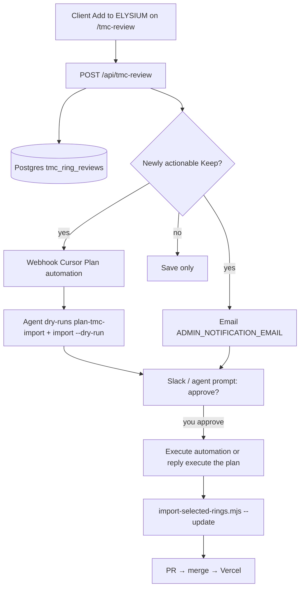

# TMC Review → notify → plan → approve → import

When the client taps **Add to ELYSIUM** on `/tmc-review` (and the row has a usable display name), ELYSIUM now:

1. **Emails you** at `ADMIN_NOTIFICATION_EMAIL` (Resend) with a proposed execution plan  
2. **Optionally fires a Cursor Automations webhook** so a cloud agent can deepen the plan and prompt you to approve  
3. **Waits for your go-ahead** before mutating `public/data/products.json`

Nothing is imported automatically.

## What changed in the app

| Piece | Role |
|-------|------|
| `POST /api/tmc-review` | After upsert, detects newly actionable Keep rows and notifies |
| `lib/tmc/notify-selection.ts` | Builds plan text, emails admin, POSTs Cursor webhook |
| `lib/tmc/selection-kind.ts` | Classifies `new_product` vs `image_replacement` |
| `scripts/plan-tmc-import.mjs` | Diffs Keep rows vs `products.json` (read-only) |
| `.cursor/automations/*.md` | Ready-to-paste Cursor Automation prompts |

### When a notification fires

- `keep` flips to `true` **and** `displayName` is non-empty, or  
- Row was already kept and the client **first sets** a display name  

Debounced field edits (price/notes/options) alone do **not** re-notify.

Display names matching `/replace/i` (e.g. “This to replace Unity images”) are classified as **image replacements**, not new products.

## One-time setup (you)

### 1. Email (already used elsewhere)

In Vercel → Project → Settings → Environment Variables:

- `RESEND_API_KEY`
- `RESEND_FROM_EMAIL`
- `ADMIN_NOTIFICATION_EMAIL` → your inbox (e.g. `rahathrahman7@gmail.com`)
- `NEXT_PUBLIC_SITE_URL` → production site URL

Redeploy after setting.

### 2. Cursor Automations (Plan + Execute)

Cursor cannot create automations via API from this agent. Create them in the UI:

1. Open [cursor.com/automations/new](https://cursor.com/automations/new)  
2. Create **TMC product import — Plan** using [`.cursor/automations/tmc-product-import-plan.md`](../.cursor/automations/tmc-product-import-plan.md)  
   - Trigger: **Webhook**  
   - Repo: this repository  
3. After save, copy webhook URL + API key into Vercel:

   - `CURSOR_TMC_AUTOMATION_WEBHOOK_URL`
   - `CURSOR_TMC_AUTOMATION_WEBHOOK_API_KEY`

4. Create **TMC product import — Execute** using [`.cursor/automations/tmc-product-import-execute.md`](../.cursor/automations/tmc-product-import-execute.md)  
   - Trigger: Slack ✅ reaction and/or comment `approve import`  
   - Or skip this and just reply `execute the plan` on the Plan agent run

Optional backup: add a **scheduled** trigger (e.g. every 6h) on the Plan automation that only runs `node scripts/plan-tmc-import.mjs` and notifies if new Keep rows appeared since last memory.

### 3. Smoke test

1. On staging/production with DB + Resend configured, open `/tmc-review`  
2. Add a named test Keep (or rename an existing kept ring from empty → named)  
3. Confirm:
   - Email arrives with execution plan + approval CTA  
   - Cursor Plan agent run starts (if webhook set)  
4. Do **not** approve unless you intend to import  

Local dry plan without writing catalog:

```bash
REVIEW_API=https://elysium-mvp.vercel.app/api/tmc-review node scripts/plan-tmc-import.mjs
node scripts/import-selected-rings.mjs --dry-run --update
```

## Execution after you approve

```bash
node scripts/import-selected-rings.mjs --update
# image replacements as needed:
# python scripts/apply-tmc-image-replacements.py
```

Then commit `public/data/products.json` + `public/products/tmc-import/**`, open/merge PR, deploy, spot-check PDPs. See also `docs/TMC_IMPORT_REPORT.md`.

## Flow


