# ELYSIUM Component Interaction Diagrams

**Version:** v1.0  
**Last Updated:** September 9, 2025  
**Generated By:** BMad Architecture Agent  

---

## Overview

This document provides visual representations of the ELYSIUM platform's component interactions, data flows, and system architecture. These diagrams help developers understand the relationships between different parts of the system.

---

## System Architecture Diagram

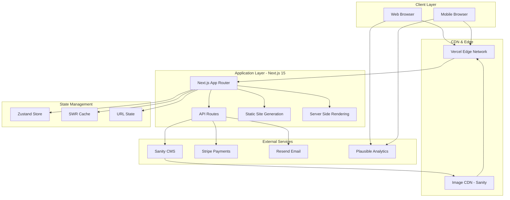

---

## User Journey Flow Diagrams

### 1. Product Discovery Journey
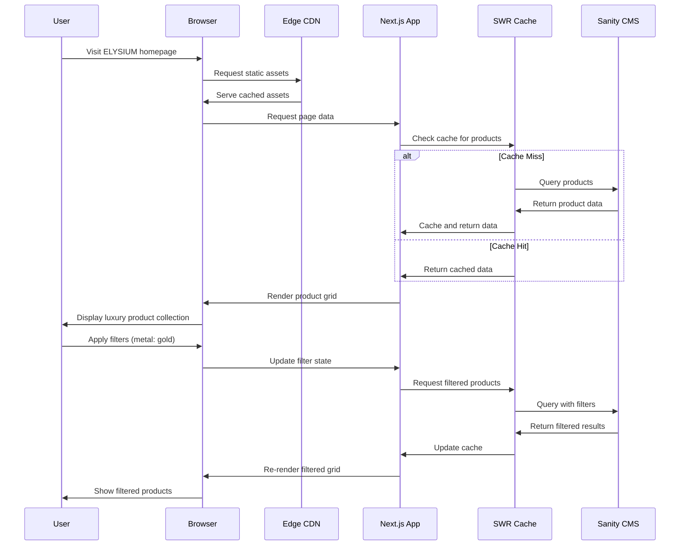

### 2. Product Configuration Journey
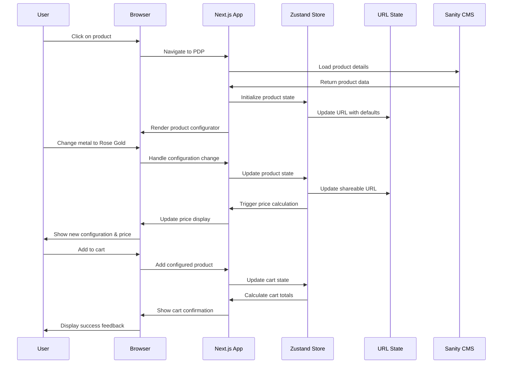

### 3. Checkout & Payment Journey
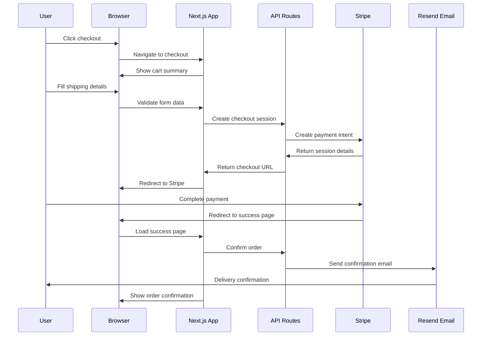

---

## Component Architecture Diagrams

### 1. Page Component Hierarchy
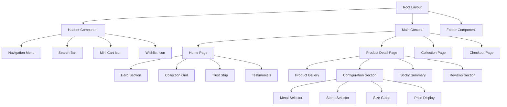

### 2. State Management Flow
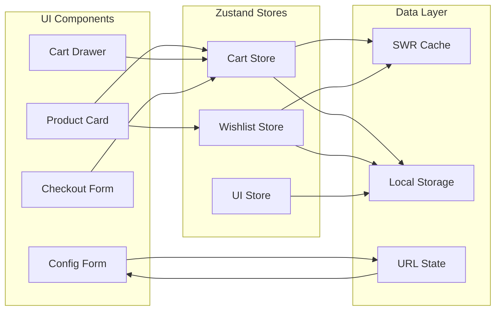

---

## API Integration Patterns

### 1. Product API Integration
```mermaid
graph TD
    subgraph "Frontend Components"
        ProductGrid[Product Grid]
        FilterBar[Filter Bar]
        SearchBox[Search Box]
    end
    
    subgraph "Data Fetching Layer"
        useSWR[useSWR Hook]
        FilterHook[useFilters Hook]
    end
    
    subgraph "API Layer"
        ProductsAPI[/api/products]
        SanityQueries[Sanity Queries]
    end
    
    ProductGrid --> useSWR
    FilterBar --> FilterHook
    SearchBox --> FilterHook
    
    useSWR --> ProductsAPI
    FilterHook --> ProductsAPI
    
    ProductsAPI --> SanityQueries
    SanityQueries --> Sanity[(Sanity CMS)]
```

### 2. Checkout API Integration
```mermaid
graph TD
    subgraph "Checkout Components"
        CartSummary[Cart Summary]
        CheckoutForm[Checkout Form]
        PaymentButton[Payment Button]
    end
    
    subgraph "API Integration"
        CheckoutAPI[/api/checkout]
        StripeAPI[Stripe API]
    end
    
    subgraph "External Services"
        StripeCheckout[Stripe Checkout]
        PaymentSuccess[Success Page]
    end
    
    CartSummary --> CheckoutAPI
    CheckoutForm --> CheckoutAPI
    PaymentButton --> CheckoutAPI
    
    CheckoutAPI --> StripeAPI
    StripeAPI --> StripeCheckout
    StripeCheckout --> PaymentSuccess
```

---

## Data Flow Diagrams

### 1. Product Data Flow
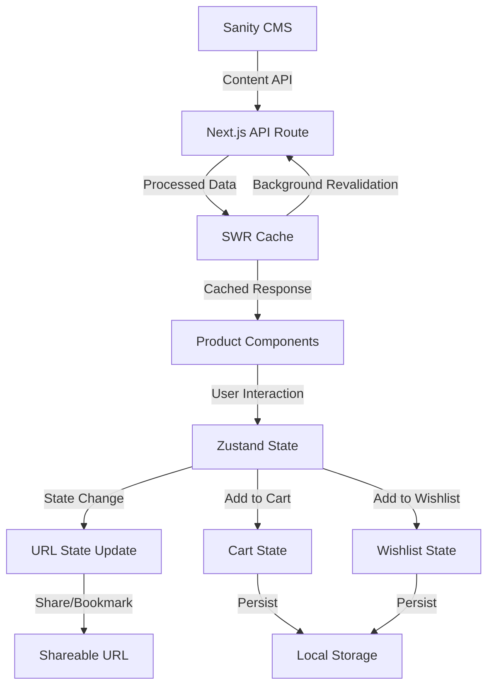

### 2. Image Optimization Flow
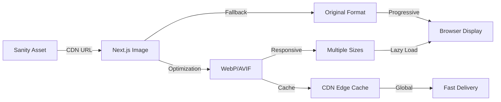

---

## Security Architecture

### 1. Data Protection Flow
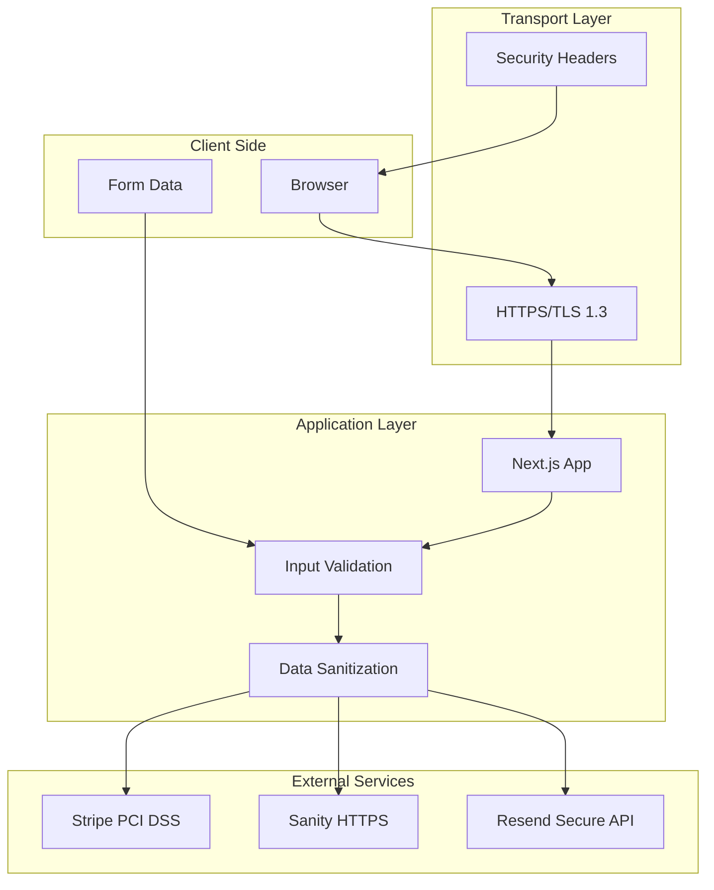

### 2. Authentication Flow (Future Implementation)
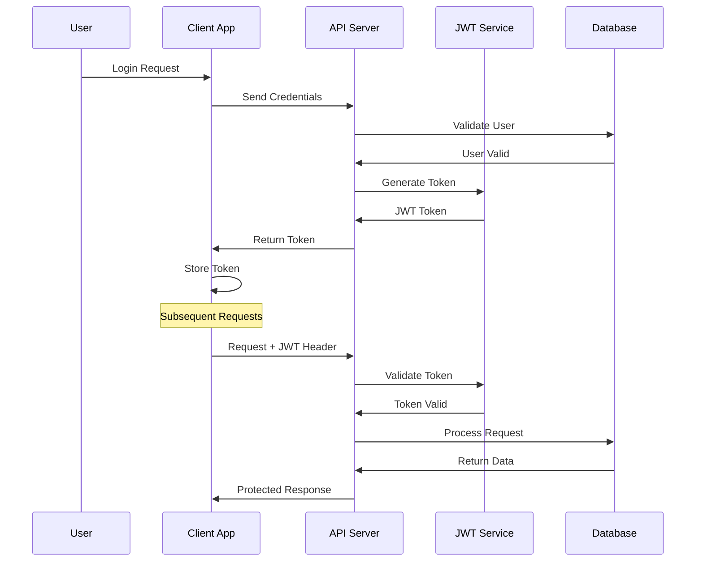

---

## Performance Architecture

### 1. Caching Strategy
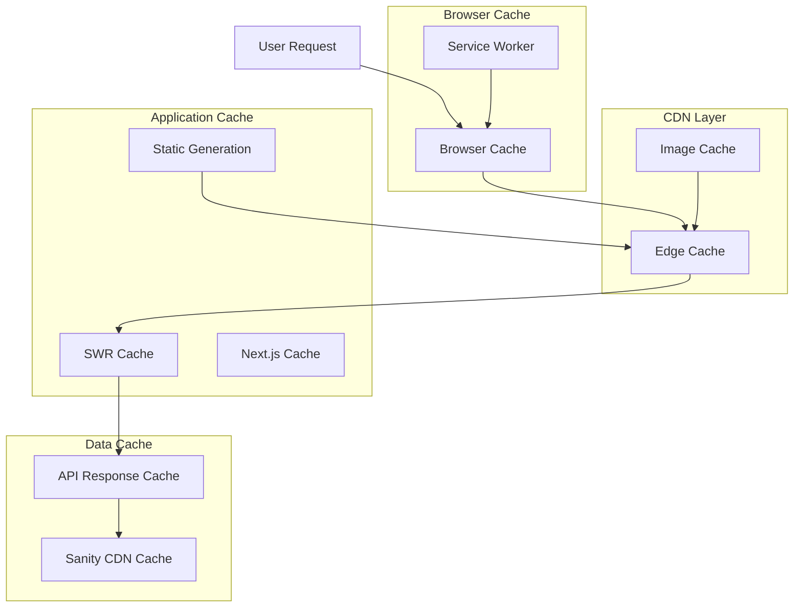

### 2. Loading Strategy
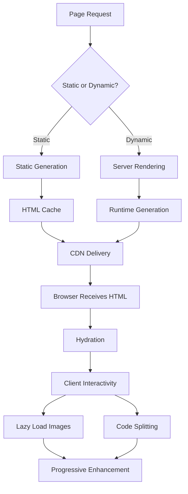

---

## Mobile-First Architecture

### 1. Responsive Component Strategy
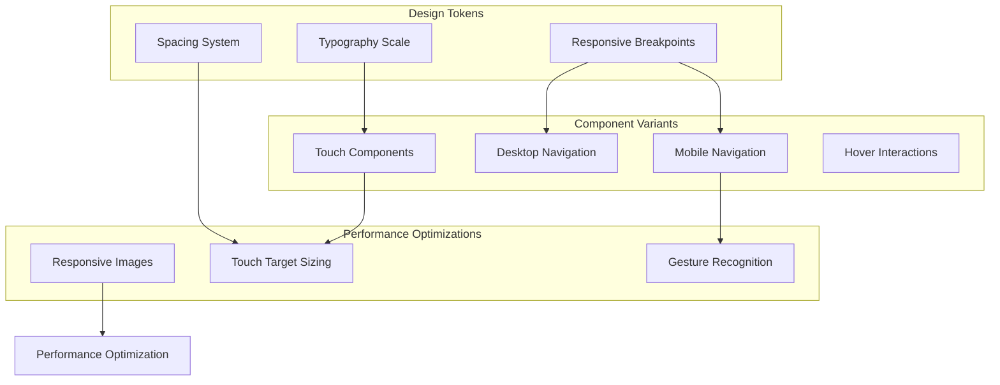

---

## Monitoring & Observability

### 1. Monitoring Data Flow
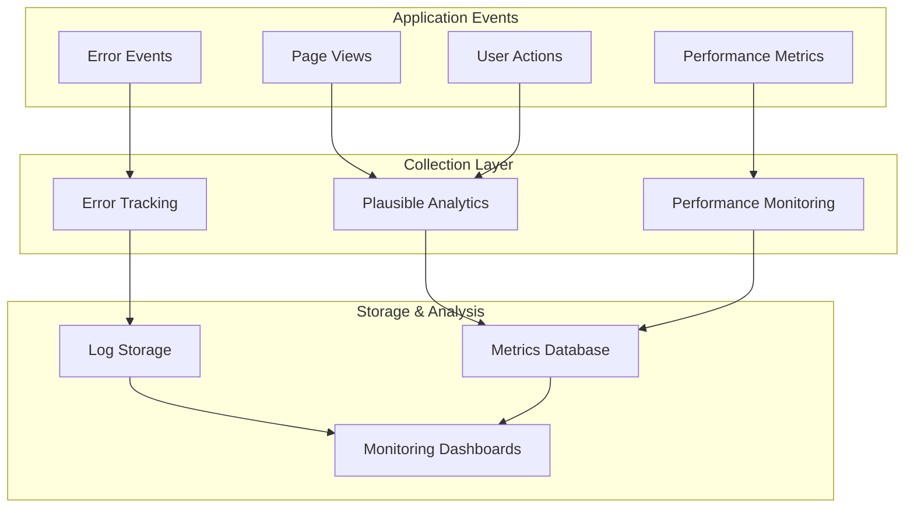

---

## Future Architecture Considerations

### 1. Microservices Evolution
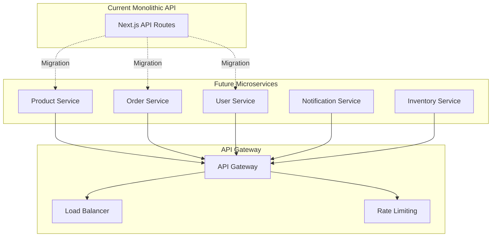

### 2. International Expansion Architecture
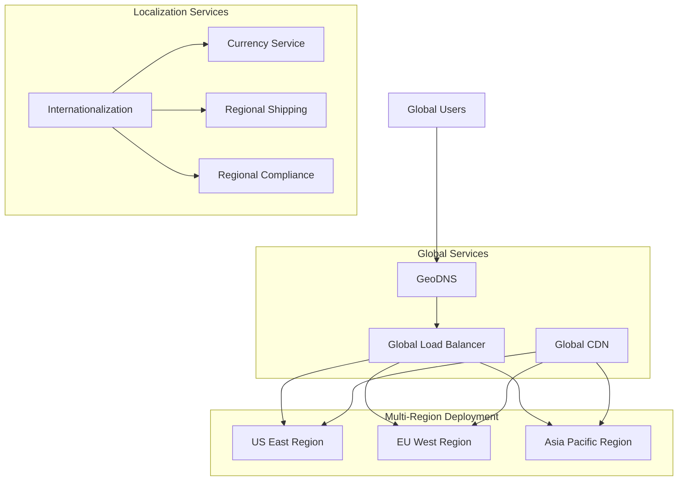

---

## Conclusion

These diagrams provide a comprehensive view of the ELYSIUM platform's architecture, from high-level system interactions to detailed component relationships. They serve as living documentation that should be updated as the system evolves.

**Key Architectural Principles Visualized:**
- **Performance-First Design:** Caching at every layer
- **Security by Design:** Protection throughout the data flow
- **Mobile-First Approach:** Responsive and touch-optimized
- **Scalability Planning:** Ready for microservices evolution
- **Global Reach:** International expansion considerations

*These diagrams should be reviewed and updated with each major architectural change or new feature implementation.*