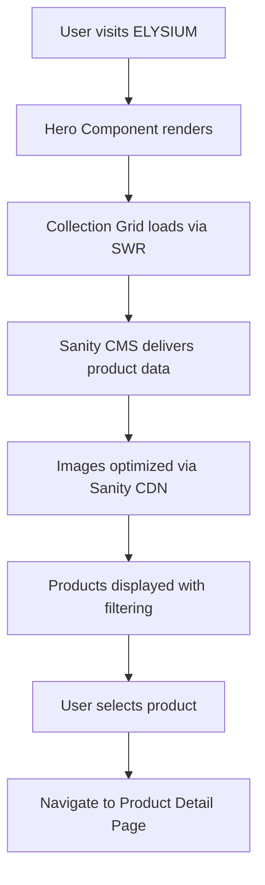
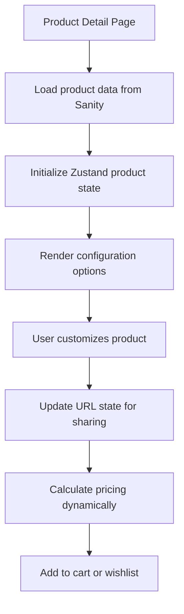

# ELYSIUM MVP System Architecture

**Document Version:** v1.0  
**Last Updated:** September 9, 2025  
**Generated By:** BMad Architecture Agent  
**Status:** Active

---

## Executive Summary

ELYSIUM is a luxury jewelry e-commerce platform built with Next.js 15, designed to provide an exceptional customer experience for high-end engagement rings and fine jewelry. The platform features sophisticated product customization capabilities, premium user experience, and integration with professional services.

## System Overview

### Architecture Philosophy
- **Performance-First**: Optimized for Core Web Vitals and luxury customer expectations
- **Security by Design**: PCI compliance considerations for payment processing
- **Scalable Foundation**: Built to handle high-value, low-volume transactions
- **Mobile Excellence**: Mobile-first responsive design with touch optimization

### Technology Stack

#### Frontend Architecture
- **Framework:** Next.js 15.0.0 (App Router)
- **Language:** TypeScript 5.5.4 (strict mode)
- **Styling:** Tailwind CSS v3.4.17 with custom luxury design system
- **State Management:** Zustand v4.5.4 for client-side state
- **Data Fetching:** SWR v2.2.5 for server state management
- **Animation:** GSAP v3.13.0 for premium interactions
- **Icons:** Lucide React v0.542.0

#### Backend & Services
- **API Routes:** Next.js API routes with TypeScript
- **CMS:** Sanity (headless CMS) with custom schemas
- **Payment Processing:** Stripe v16.0.0 integration
- **Email Service:** Resend v4.0.0 for transactional emails
- **Image Optimization:** Next.js Image component with Sanity CDN

#### Development & Operations
- **Package Manager:** pnpm (optimized workspace management)
- **Testing:** Playwright v1.47.0 for end-to-end testing
- **Linting:** ESLint with Next.js configuration
- **Type Checking:** Strict TypeScript configuration
- **Security Headers:** Implemented via Next.js headers configuration

---

## System Components

### 1. Frontend Application Layer

#### Application Structure
```
app/                          # Next.js App Router
├── api/                     # Server-side API routes
│   ├── products/           # Product catalog management
│   ├── checkout/           # Payment processing
│   └── bespoke/           # Custom jewelry requests
├── (routes)/              # Page routes
│   ├── products/[slug]/   # Dynamic product pages
│   ├── collection/[handle]/ # Collection browsing
│   ├── education/         # Educational content
│   └── bespoke/          # Custom services
└── globals.css           # Global styling
```

#### Component Architecture
```
components/                   # Reusable UI components
├── ui/                      # Core UI primitives
│   ├── Header.tsx          # Global navigation
│   ├── ProductCard.tsx     # Product display
│   └── LuxuryButton.tsx    # Branded interactive elements
├── sections/               # Page-level sections
│   ├── Hero.tsx           # Landing page hero
│   ├── CollectionGrid.tsx # Product collections
│   └── Testimonials.tsx   # Social proof
├── pdp/                   # Product Detail Page
│   ├── Gallery.tsx        # Image gallery with zoom
│   ├── StickySummary.tsx  # Purchase configuration
│   └── ProductReviews.tsx # Customer reviews
└── filters/               # Product filtering system
    ├── FiltersDrawer.tsx  # Mobile filter interface
    └── FilterSections.tsx # Filter categories
```

### 2. Data Management Layer

#### State Management Strategy
- **Client State:** Zustand stores for cart, wishlist, and UI state
- **Server State:** SWR for API data caching and synchronization
- **Form State:** React Hook Form for complex product configuration
- **URL State:** Next.js router for shareable product configurations

#### Content Management (Sanity)
```typescript
// Product Schema Structure
interface Product {
  _id: string
  slug: string
  name: string
  description: string
  basePrice: number
  images: SanityImage[]
  variants: ProductVariant[]
  customization: CustomizationOptions
  seo: SEOSettings
}
```

### 3. API Layer

#### Endpoint Architecture
```typescript
// API Route Structure
/api/products          # GET: Product catalog with filtering
/api/checkout          # POST: Stripe payment intent creation
/api/bespoke          # POST: Custom jewelry consultation requests
```

#### Integration Points
- **Stripe Integration:** Payment processing and webhook handling
- **Sanity CMS:** Content delivery and asset management
- **Resend Email:** Transactional email delivery
- **External APIs:** Future integrations (inventory, shipping, CRM)

### 4. Security Layer

#### Implemented Security Measures
```typescript
// Next.js Security Headers
headers: [
  { key: "X-Frame-Options", value: "SAMEORIGIN" },
  { key: "X-Content-Type-Options", value: "nosniff" },
  { key: "Referrer-Policy", value: "strict-origin-when-cross-origin" },
  { key: "Permissions-Policy", value: "camera=(), microphone=(), geolocation=()" }
]
```

#### Security Considerations
- **PCI Compliance:** Stripe handles sensitive payment data
- **OWASP Protection:** XSS, CSRF, and injection prevention
- **Data Privacy:** GDPR-ready data handling patterns
- **Rate Limiting:** Future implementation for API protection

---

## Data Flow Architecture

### 1. Product Discovery Flow


### 2. Product Configuration Flow


### 3. Checkout Flow
```mermaid
graph TD
    A[Cart Review] --> B[Checkout initiation]
    B --> C[Create Stripe Payment Intent]
    C --> D[Collect shipping information]
    D --> E[Payment processing via Stripe]
    E --> F[Order confirmation]
    F --> G[Email confirmation via Resend]
    G --> H[Order fulfillment (external)]
```

---

## Performance Architecture

### Optimization Strategies
1. **Image Optimization:**
   - Next.js Image component with lazy loading
   - Sanity CDN for responsive image delivery
   - WebP format with fallbacks

2. **Code Splitting:**
   - Next.js automatic code splitting
   - Dynamic imports for non-critical components
   - Optimized package imports for SWR and Zustand

3. **Caching Strategy:**
   - SWR for client-side data caching
   - Static generation for product pages
   - CDN caching for assets

4. **Animation Performance:**
   - GSAP with hardware acceleration
   - Reduced motion support for accessibility
   - Performance-first interaction design

### Performance Metrics
- **Target Lighthouse Score:** 95+ for all metrics
- **Core Web Vitals:** Optimized for luxury customer expectations
- **Mobile Performance:** Touch-optimized interactions

---

## Deployment Architecture

### Current Deployment Strategy
- **Platform:** Vercel (recommended for Next.js optimization)
- **Domain:** Custom domain with SSL/TLS
- **CDN:** Global edge network for asset delivery
- **Environment Variables:** Secure configuration management

### Infrastructure Considerations
```typescript
// Environment Configuration
SANITY_PROJECT_ID=<project-id>
SANITY_DATASET=production
STRIPE_SECRET_KEY=<secret-key>
STRIPE_PUBLISHABLE_KEY=<public-key>
RESEND_API_KEY=<api-key>
NEXT_PUBLIC_SITE_URL=https://elysium-mvp.vercel.app
```

### Monitoring & Observability
- **Error Tracking:** Recommended Sentry integration
- **Analytics:** Plausible Analytics (privacy-focused)
- **Performance Monitoring:** Real User Monitoring (RUM)
- **Uptime Monitoring:** Health check endpoints

---

## Scalability Considerations

### Current Architecture Limits
- **Concurrent Users:** Single-region deployment
- **Product Catalog:** Sanity CMS scaling limitations
- **Payment Volume:** Stripe rate limits
- **Image Storage:** CDN bandwidth considerations

### Scaling Strategies
1. **Horizontal Scaling:**
   - Multi-region deployment
   - Edge compute for dynamic content
   - Database read replicas

2. **Performance Scaling:**
   - Advanced caching strategies
   - Progressive Web App implementation
   - Service Worker for offline functionality

3. **Feature Scaling:**
   - Microservices architecture for complex features
   - Third-party integrations (ERP, CRM, inventory)
   - Advanced personalization engine

---

## Security & Compliance

### Data Protection
- **Customer Data:** Encrypted at rest and in transit
- **Payment Data:** PCI-compliant via Stripe
- **Session Management:** Secure JWT implementation
- **Privacy Controls:** Cookie consent and data portability

### Compliance Frameworks
- **GDPR:** European data protection compliance
- **PCI DSS:** Payment card industry standards
- **CCPA:** California consumer privacy act
- **ADA:** Web accessibility compliance (WCAG 2.1)

---

## Development Guidelines

### Code Quality Standards
- **TypeScript:** Strict mode with comprehensive type coverage
- **ESLint:** Next.js recommended configuration
- **Prettier:** Consistent code formatting
- **Playwright:** End-to-end testing coverage

### Component Development
- **Design System:** Tailwind CSS with custom luxury tokens
- **Accessibility:** WCAG 2.1 AA compliance
- **Performance:** Core Web Vitals optimization
- **Testing:** Unit tests for business logic

### API Development
- **OpenAPI:** Future API documentation standard
- **Validation:** Zod schema validation
- **Error Handling:** Structured error responses
- **Rate Limiting:** Protection against abuse

---

## Future Architecture Evolution

### Planned Enhancements
1. **Advanced Personalization:**
   - AI-powered product recommendations
   - Customer behavior analytics
   - Dynamic pricing strategies

2. **Enterprise Features:**
   - B2B portal for trade customers
   - Advanced inventory management
   - Multi-currency support

3. **Technology Upgrades:**
   - React Server Components adoption
   - Edge runtime optimization
   - Advanced caching strategies

### Migration Considerations
- **Database Evolution:** Transition to production database
- **API Versioning:** Backwards compatibility strategy
- **Performance Monitoring:** Advanced observability stack
- **Security Hardening:** Penetration testing and audits

---

## Conclusion

The ELYSIUM MVP architecture provides a solid foundation for a luxury e-commerce platform with room for growth and enhancement. The technology stack is modern, performant, and aligned with industry best practices for security and user experience.

**Next Steps:**
1. Implement comprehensive monitoring
2. Add unit testing coverage
3. Enhance security measures
4. Plan for international expansion

---

*This document is maintained by the development team and should be updated with any architectural changes or enhancements.*