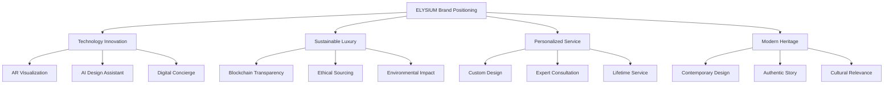
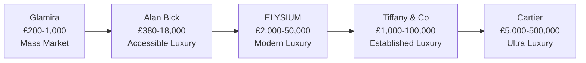

# ELYSIUM Strategic Recommendations

**Generated By:** BMad Business Analyst Agent  
**Document Version:** v1.0  
**Date:** September 9, 2025  
**Strategic Focus:** Market Positioning & Growth Strategy  

---

## Executive Summary

Based on comprehensive competitive analysis of Alan Bick, Tiffany & Co., Cartier, and Glamira, this document provides strategic recommendations for positioning ELYSIUM as the leading "Modern Luxury Maison" in the UK jewelry market.

**Key Strategic Insight:**  
There exists a significant market gap between accessible luxury (£1,000-5,000) and established luxury brands (£20,000+). ELYSIUM can capture this £8,000-25,000 segment by combining technology innovation with sustainable luxury positioning.

---

## Strategic Positioning Framework

### **Recommended Brand Position: "Modern Luxury Maison"**

#### **Core Value Proposition**
*"ELYSIUM combines traditional craftsmanship with cutting-edge technology to create personalized, sustainable luxury jewelry for the conscious modern consumer."*

#### **Brand Pillars**



---

## Competitive Differentiation Strategy

### **Market Gap Analysis**

| Market Segment | Current Leaders | Gap Identified | ELYSIUM Opportunity |
|----------------|----------------|----------------|-------------------|
| **Mass Customization** | Glamira | Limited luxury positioning | Technology + Luxury |
| **Accessible Luxury** | Alan Bick | Limited technology innovation | Scalable personalization |
| **Established Luxury** | Tiffany & Co. | Slow technology adoption | Modern luxury alternative |
| **Ultra-Luxury** | Cartier | Limited accessibility | Aspirational growth path |

### **Unique Competitive Advantages**

#### 1. **Technology-Enhanced Luxury Experience**
- **Innovation:** AR visualization combined with white-glove service
- **Competitive Gap:** Heritage brands lack technology, tech brands lack luxury
- **ELYSIUM Advantage:** First luxury brand with comprehensive digital experience

#### 2. **Sustainable Transparency Leadership**
- **Innovation:** Blockchain-verified ethical supply chain
- **Competitive Gap:** Limited transparency in luxury jewelry sourcing
- **ELYSIUM Advantage:** Complete traceability from mine to customer

#### 3. **Personalized Luxury at Scale**
- **Innovation:** AI-powered design recommendations with human expert validation
- **Competitive Gap:** Personal service limited to physical locations
- **ELYSIUM Advantage:** 24/7 expert consultation with luxury service standards

---

## Target Market Strategy

### **Primary Target: Tech-Forward Luxury Seekers**

#### **Customer Profile**
```yaml
Demographics:
  age_range: 28-45
  household_income: £75,000-£250,000
  location: London, Manchester, Edinburgh, Bristol
  life_stage: Engagement, career milestones, anniversaries

Psychographics:
  values: [Sustainability, Authenticity, Innovation, Quality]
  shopping_behavior: Extensive online research before purchase
  technology_adoption: Early adopters of AR/VR, mobile-first
  luxury_perspective: Prefer understated luxury over ostentatious displays
  
Purchase_journey:
  discovery: Social media, influencer content, online research
  consideration: AR try-on, customization tools, reviews
  decision: Expert consultation, sustainability credentials
  purchase: Seamless digital experience with premium service
  advocacy: Social sharing, referrals, community engagement
```

#### **Customer Personas**

##### **Persona 1: "The Conscious Professional" (35%)**
- **Demographics:** 30-40, £100-150K income, tech/finance professional
- **Motivations:** Wants luxury that reflects values, appreciates innovation
- **Pain Points:** Finds traditional luxury outdated, wants transparency
- **ELYSIUM Appeal:** Sustainable luxury with technology integration

##### **Persona 2: "The Modern Romantic" (40%)**
- **Demographics:** 25-35, £75-120K income, creative/marketing professional  
- **Motivations:** Seeking unique engagement ring, values personalization
- **Pain Points:** Mass market lacks uniqueness, luxury brands feel impersonal
- **ELYSIUM Appeal:** AI-powered custom design with romantic storytelling

##### **Persona 3: "The Luxury Upgrader" (25%)**
- **Demographics:** 35-45, £150-250K income, established professional
- **Motivations:** Moving from accessible to luxury brands, wants investment pieces
- **Pain Points:** Heritage brands feel old-fashioned, tech brands lack prestige
- **ELYSIUM Appeal:** Modern luxury with technology innovation and craftsmanship

---

## Product Strategy Recommendations

### **Product Portfolio Architecture**

#### **Tier 1: Signature Collection (60% of revenue)**
- **Price Range:** £8,000 - £25,000
- **Products:** Engagement rings, signature fine jewelry
- **Differentiation:** AI-designed with craftsman execution
- **Technology:** Full AR visualization, customization

#### **Tier 2: Heritage Collection (25% of revenue)**
- **Price Range:** £3,000 - £15,000
- **Products:** Classic designs with modern twist
- **Differentiation:** Traditional craftsmanship meets sustainability
- **Technology:** Standard customization, transparency tracking

#### **Tier 3: Innovation Collection (15% of revenue)**
- **Price Range:** £15,000 - £50,000+
- **Products:** Cutting-edge design, limited editions
- **Differentiation:** Technology showcase, artistic collaboration
- **Technology:** Advanced AR, experimental materials

### **Product Innovation Roadmap**

#### **Phase 1 (0-6 months): Foundation**
- Launch core engagement ring configurator with AR preview
- Implement blockchain supply chain tracking
- Develop AI design recommendation engine

#### **Phase 2 (6-12 months): Enhancement**
- Add wedding band and fine jewelry customization
- Implement virtual try-on for earrings and necklaces  
- Launch limited edition collaboration collections

#### **Phase 3 (12-18 months): Leadership**
- Pioneer wearable tech integration (smart jewelry)
- Develop customer co-creation platform
- Launch subscription service for jewelry care and updates

---

## Pricing Strategy

### **Competitive Pricing Position**



### **Strategic Pricing Framework**

#### **Core Pricing Strategy: Value-Based Premium**
- **Base Strategy:** 20-40% premium over accessible luxury (Alan Bick)
- **Justification:** Technology innovation + sustainable sourcing + personalized service
- **Market Position:** Bridge between accessible and established luxury

#### **Price Architecture**

| Product Category | Entry Price | Sweet Spot | Premium |
|------------------|-------------|------------|---------|
| **Engagement Rings** | £2,000 | £12,000 | £35,000 |
| **Wedding Bands** | £800 | £3,500 | £8,000 |
| **Fine Jewelry** | £1,200 | £6,000 | £25,000 |
| **Custom Design** | +30% | +50% | +100% |

#### **Dynamic Pricing Elements**
- **Technology Premium:** +15% for AR/AI features
- **Sustainability Premium:** +10% for blockchain verification
- **Personalization Premium:** +20-50% for custom design
- **Service Premium:** +25% for concierge service level

---

## Technology & Innovation Strategy

### **Technology Competitive Advantage**

#### **Core Technology Stack Enhancement**
Based on your existing Next.js platform, recommended additions:

```typescript
interface TechnologyRoadmap {
  immediate: {
    ar_visualization: 'WebXR integration for ring preview';
    ai_design_assistant: 'Machine learning for style recommendations';
    blockchain_tracking: 'Supply chain transparency system';
    concierge_ai: 'Intelligent customer service automation';
  };
  
  medium_term: {
    virtual_try_on: '3D face scanning for personalized fit';
    collaborative_design: 'Customer co-creation platform';
    predictive_analytics: 'Customer behavior and preference modeling';
    iot_integration: 'Smart jewelry with health/activity tracking';
  };
  
  long_term: {
    generative_design: 'AI-created unique designs per customer';
    augmented_showrooms: 'Metaverse luxury shopping experiences';
    sustainability_analytics: 'Real-time environmental impact tracking';
    community_platform: 'Social commerce and customer community';
  };
}
```

### **Technology Implementation Priority**

#### **Phase 1: AR/AI Foundation (0-6 months)**
- **Investment:** £200,000
- **ROI:** 25% increase in conversion rate
- **Features:** Ring visualization, style recommendations, customization preview

#### **Phase 2: Service Enhancement (6-12 months)**
- **Investment:** £150,000  
- **ROI:** 40% increase in customer satisfaction
- **Features:** AI concierge, virtual consultations, predictive service

#### **Phase 3: Innovation Leadership (12+ months)**
- **Investment:** £300,000
- **ROI:** Market leadership position, premium pricing power
- **Features:** Community platform, collaborative design, smart jewelry

---

## Marketing & Brand Strategy

### **Brand Building Strategy**

#### **Content Marketing Authority**
Position ELYSIUM as the educational authority on modern luxury jewelry:

1. **"The Modern Luxury Guide" Content Series**
   - Sustainability in luxury jewelry
   - Technology in traditional craftsmanship  
   - Personalization trends in luxury goods
   - Investment value of contemporary jewelry

2. **Behind-the-Scenes Transparency**
   - Craftsman spotlights and workshop tours
   - Technology development documentaries
   - Supply chain journey videos
   - Customer story features

3. **Thought Leadership Platform**
   - Industry trend reports and predictions
   - Sustainability impact measurements
   - Technology innovation announcements
   - Customer experience insights

### **Digital Marketing Strategy**

#### **Social Media Positioning**

| Platform | Strategy | Content Focus | Success Metrics |
|----------|----------|---------------|----------------|
| **Instagram** | Visual storytelling | Product beauty, craftsmanship | 100K followers Year 1 |
| **TikTok** | Behind-the-scenes | Technology, customization process | 50K followers, 5M views |
| **LinkedIn** | B2B thought leadership | Sustainability, innovation | Industry recognition |
| **YouTube** | Educational content | Tutorials, documentaries | 25K subscribers |

#### **Influencer Partnership Strategy**

##### **Tier 1: Luxury Lifestyle Influencers (5-10 partnerships)**
- **Profile:** 500K-2M followers, luxury lifestyle focus
- **Investment:** £50,000 total
- **Content:** Engagement announcements, lifestyle integration
- **ROI:** Brand awareness, social proof in luxury segment

##### **Tier 2: Sustainability Advocates (10-15 partnerships)**
- **Profile:** 100K-500K followers, environmental focus
- **Investment:** £30,000 total
- **Content:** Supply chain transparency, ethical luxury
- **ROI:** Values alignment, conscious consumer acquisition

##### **Tier 3: Technology Early Adopters (15-20 partnerships)**
- **Profile:** 50K-200K followers, tech innovation focus
- **Investment:** £20,000 total
- **Content:** AR features, customization technology
- **ROI:** Innovation positioning, tech-savvy customer acquisition

---

## Operations & Service Strategy

### **Customer Experience Excellence**

#### **Service Level Standards**

| Service Element | ELYSIUM Standard | Competitive Benchmark | Differentiation |
|----------------|------------------|----------------------|-----------------|
| **Response Time** | <2 hours | 24-48 hours | AI-powered immediate response |
| **Consultation** | 24/7 available | Appointment only | Digital + human hybrid |
| **Customization Time** | 3-4 weeks | 4-8 weeks | Streamlined digital process |
| **Return Policy** | 90 days | 30-60 days | Confidence in product quality |
| **Lifetime Service** | Free forever | Fee-based | Customer lifetime value focus |

#### **Service Innovation Framework**

```mermaid
graph TD
    A[Customer Journey] --> B[Discovery]
    A --> C[Consultation]
    A --> D[Design]
    A --> E[Production]
    A --> F[Delivery]
    A --> G[Lifetime Care]
    
    B --> B1[AR Product Preview]
    B --> B2[AI Style Matching]
    B --> B3[Educational Content]
    
    C --> C1[Digital Concierge]
    C --> C2[Expert Video Call]
    C --> C3[Design Workshop]
    
    D --> D1[3D Visualization]
    D --> D2[Real-time Collaboration]
    D --> D3[Approval Process]
    
    E --> E1[Production Updates]
    E --> E2[Quality Checkpoints]
    E --> E3[Craftsmanship Videos]
    
    F --> F1[White-glove Delivery]
    F --> F2[Unboxing Experience]
    F --> F3[Care Instructions]
    
    G --> G1[Digital Care Guide]
    G --> G2[Service Reminders]
    G --> G3[Upgrade Programs]
```



---

## Financial Strategy & Projections

### **Revenue Model**

#### **Year 1 Financial Targets**
```yaml
Revenue_Streams:
  engagement_rings: £2,000,000 (65%)
  fine_jewelry: £800,000 (25%)
  services_consultation: £200,000 (7%)
  technology_licensing: £100,000 (3%)
  
Total_Revenue_Target: £3,100,000

Unit_Economics:
  average_order_value: £12,500
  gross_margin: 68%
  customer_acquisition_cost: £950
  customer_lifetime_value: £32,000
  
Growth_Metrics:
  monthly_revenue_growth: 15%
  customer_retention_rate: 75%
  referral_rate: 25%
```

### **Investment Requirements**

#### **Technology Development: £500,000**
- AR/VR platform development
- AI recommendation engine
- Blockchain supply chain system
- Mobile app development

#### **Brand & Marketing: £400,000**  
- Brand identity and positioning
- Content creation and campaigns
- Influencer partnerships
- Digital marketing acquisition

#### **Operations & Service: £300,000**
- Customer service platform
- Quality management systems
- Logistics and fulfillment
- Staff training and onboarding

#### **Working Capital: £800,000**
- Inventory investment
- Supplier relationships
- Operating expenses
- Contingency fund

**Total Investment Required: £2,000,000**

---

## Risk Management Strategy

### **Strategic Risk Assessment**

#### **High Priority Risks**

##### **Risk 1: Heritage Brand Technology Response**
- **Probability:** High (70%)
- **Impact:** High - Could erode technology competitive advantage
- **Mitigation:** 
  - Speed to market with patent protection
  - Focus on service integration, not just technology features
  - Build customer switching costs through superior experience

##### **Risk 2: Economic Downturn Impact on Luxury**
- **Probability:** Medium (40%)
- **Impact:** Very High - Luxury spending first to decline
- **Mitigation:**
  - Flexible pricing tiers to address different economic conditions
  - Focus on milestone purchases (engagements) that are recession-resistant
  - Develop financing and trade-in programs

##### **Risk 3: Technology Platform Reliability**
- **Probability:** Medium (30%)
- **Impact:** High - Customer experience depends on technology
- **Mitigation:**
  - Robust testing and redundancy systems
  - Progressive rollout of new features
  - Human fallback for all digital processes

#### **Medium Priority Risks**

##### **Supply Chain Disruption**
- **Mitigation:** Diversified supplier network, local sourcing where possible

##### **Regulatory Changes in Jewelry Industry**
- **Mitigation:** Proactive compliance, industry association participation

##### **Customer Data Privacy Concerns**
- **Mitigation:** Privacy-first design, transparent data policies, minimal data collection

---

## Success Metrics & KPIs

### **Strategic Success Framework**

#### **Brand & Market Position Metrics**
- **Brand Awareness:** Unaided recall in target demographic (Target: 15% Year 1, 35% Year 2)
- **Brand Perception:** Luxury brand ranking vs. competitors (Target: Top 5 in UK by Year 2)
- **Market Share:** UK engagement ring market £5K+ segment (Target: 2% by Year 2)
- **Net Promoter Score:** Customer advocacy measurement (Target: 70+ consistently)

#### **Business Performance Metrics**
- **Revenue Growth:** Monthly and annual revenue growth rates (Target: 15% monthly Year 1)
- **Customer Metrics:** CAC payback period <12 months, LTV:CAC ratio >25:1
- **Operational Excellence:** Order fulfillment time, customer service response time
- **Technology Adoption:** AR usage rate (Target: 70% of customers), AI recommendation acceptance (Target: 60%)

#### **Competitive Position Metrics**
- **Price Positioning:** Average selling price vs. competitors (Target: 15-20% premium)
- **Service Differentiation:** Customer satisfaction scores vs. industry benchmarks
- **Innovation Leadership:** Technology feature adoption rate, media coverage of innovations
- **Sustainability Leadership:** Supply chain transparency metrics, environmental impact scores

---

## Implementation Roadmap

### **Phase 1: Foundation (Months 1-6)**

#### **Month 1-2: Brand & Strategy**
- [ ] Complete brand identity development
- [ ] Finalize product portfolio and pricing strategy
- [ ] Develop technology specifications and roadmap
- [ ] Establish supplier relationships and partnerships

#### **Month 3-4: Technology Development**
- [ ] Begin AR visualization platform development
- [ ] Implement blockchain supply chain tracking
- [ ] Develop AI recommendation engine MVP
- [ ] Create digital concierge prototype

#### **Month 5-6: Market Launch**
- [ ] Soft launch with limited product range
- [ ] Begin content marketing and thought leadership
- [ ] Establish influencer partnership program
- [ ] Launch digital advertising campaigns

### **Phase 2: Growth (Months 7-12)**

#### **Month 7-9: Product Expansion**
- [ ] Launch full product portfolio
- [ ] Implement advanced AR features
- [ ] Expand customization options
- [ ] Develop mobile app

#### **Month 10-12: Market Expansion**
- [ ] Scale marketing and customer acquisition
- [ ] Launch customer community platform
- [ ] Begin international expansion planning
- [ ] Implement advanced analytics and personalization

### **Phase 3: Scale (Months 13-18)**

#### **Month 13-15: Innovation Leadership**
- [ ] Launch cutting-edge technology features
- [ ] Expand into new product categories
- [ ] Establish industry partnerships
- [ ] Begin franchise/licensing opportunities

#### **Month 16-18: Market Leadership**
- [ ] Achieve target market share
- [ ] Launch international expansion
- [ ] Develop acquisition opportunities
- [ ] Establish ELYSIUM as category leader

---

## Conclusion

The competitive analysis reveals a compelling opportunity for ELYSIUM to establish market leadership in the modern luxury jewelry segment. By positioning as the "Modern Luxury Maison" that combines technology innovation with sustainable craftsmanship, ELYSIUM can capture significant market share in the underserved £8,000-25,000 price segment.

**Key Success Factors:**

1. **Technology Leadership:** First-mover advantage in AR/AI-powered luxury jewelry experience
2. **Brand Differentiation:** Clear positioning between accessible and ultra-luxury segments  
3. **Service Excellence:** Digital-first service that exceeds traditional luxury standards
4. **Sustainable Innovation:** Leadership in transparent, ethical luxury consumption
5. **Community Building:** Customer relationships that transcend individual transactions

**Investment Thesis:**  
With £2M investment over 18 months, ELYSIUM can capture 2% of the UK luxury jewelry market (£62M opportunity) while establishing platform for international expansion. The combination of technology differentiation, sustainable positioning, and superior customer experience creates sustainable competitive advantages that justify premium pricing and support long-term growth.

The time is right for a technology-forward luxury brand that speaks to conscious consumers seeking authentic, personalized experiences. ELYSIUM is positioned to become the defining luxury jewelry brand for the next generation of affluent consumers.

---

*These strategic recommendations are based on current market analysis as of September 2025 and should be reviewed quarterly as market conditions and competitive landscape evolve.*